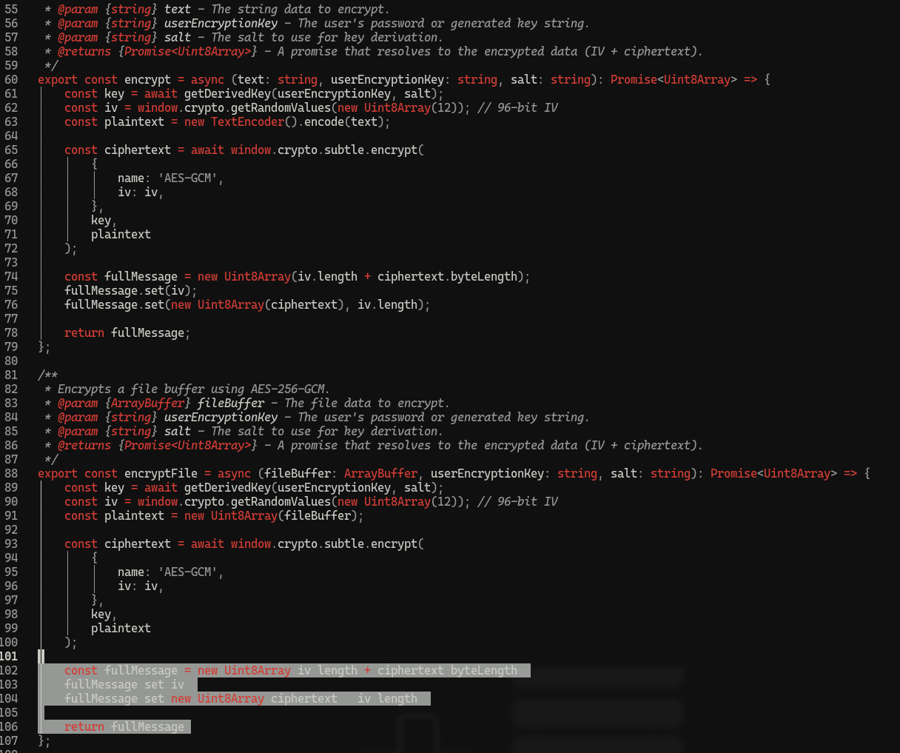

# nes

A retro, elegant, nes theme for Neovim.

<p align="center">
  
</p>

## Installation

Install with your favorite plugin manager.

### lazy.nvim

Add the following to your `lazy.nvim` configuration:

```lua
{
  "bjarneo/nes.nvim",
  priority = 1000,
  config = function()
    vim.cmd([[colorscheme ash]])
  end,
}
```

## Usage

To use the theme, add the following to your `init.lua`:

```lua
vim.cmd.colorscheme "nes"
```

